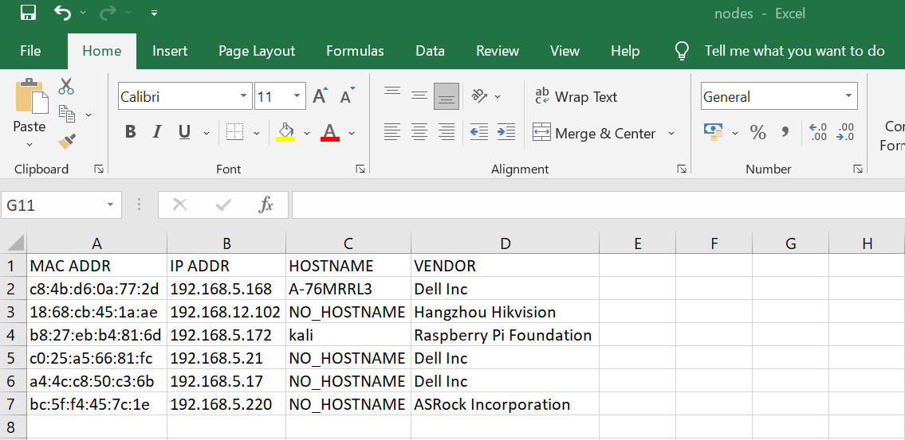

# DHCP Log Analyzer

### Table of Contents
**[Description](#description)**<br>
**[Requirements](#requirements)**<br>
**[Tested On](#tested-on)**<br>
**[Sample Execution](#sample-execution)**<br>
**[Input](#input)**<br>
**[Output](#output)**<br>
**[Functionalities](#functionalities)**<br>
**[Authors](#authors)**<br>

# Description
This is a log analysis tool that is used to collect, parse, and analyze the data written to DHCP log files. This script generates a csv file that contains a unique list of network devices that are connected to the system. The script reads the provided dhcpd log file and filters the line containing the message "DHCPACK," acknowledging that the IP address in question has been successfully leased to the client, and then filters out the mac address, ip address, hostname, and vendor name. In order to get the vendor name of the device, the script compares the MAC address with the OUI dictionary. Finally, writes the information to the csv file as required.

## Requirements
- Operating System : > Windows-10, Ubuntu 22.04.1 LTS
- Python :  > Version 3.10.7 

## Tested On

Windows-10-10.0.22621-SP0 with Python version 3.10.7

## Sample Execution 

Go to the project directory and run below command :
```python
python main.py
``` 

## Input

The script accepts two input variables in main.py namely DHCPD_LOG_PATH and OUTPUT_CSV_FILE which are used to provide log path and output filelocation for the csv file generated respectively.
```python
DHCPD_LOG_PATH = './dhcpd.log'
OUTPUT_CSV_FILE = "nodes.csv"
```

## Output

This will create a nodes.csv with unique nodes connected the system. The generated csv file will have below details on the connected devices:
- Mac Address
- IP Address
- Hostname 
- VENDOR



## Functionalities

| Script   |      Usage      | 
|----------| :---------------|
| create_directory.bat | Batch file to create project directories   | 
| create_directory.sh | Bash script to create project directories   | 
| check_file.py |  Confirm log path exists |
| open_file.py |  Reads file line by line   | 
| filter_dhcpd_log.py | To extract required details from log file| 
| get_mac_details.py | To get vendor details| 
| macaddress_dict.py |  Dictionary of MAC address |
| to_csv.py | To create required csv file | 
| pylint_testing.sh  | Bash script to perform pylint test| 
| test_dhcp_log_analyser.py | To perform unit testing on functions used  | 
  
## Authors

DHCP Log Analyzer tool was developed as a part of Infrastructure as Code module's assignment by Krishnendu VP.